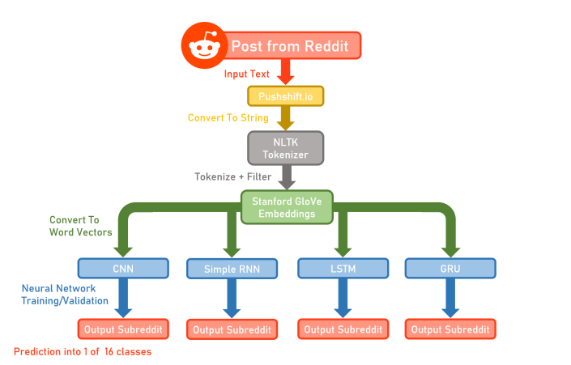

# Where2Spreddit

A collection of self-trained Neural Networks for classifying Reddit posts and Comments.

## Description

Where2Spreddit classifies any sentence into a relevant category on the popular discussion site Reddit.
The included trainer allows automated training (with customizable options) on four different neural network architectures.
- Convolutional Neural Networks (CNNs)
- Simple Recurrent Neural Networks (RNNs)
- Long short-term Memory Networks (LSTMs)
- Gated Recurrent Units (GRUs)

The following diagram illustrates the flow of the Where2Spreddit neural networks:



## Installation Instructions

### 1. Clone this repository to your local workspace

### 2. Install required Python packages specified in `requirements.txt`

From root directory of repo, run `pip3 install -r requirements.txt`. It is highly recommended to use a clean virtual environment to prevent conflicts with other packages.

### 3. Install redditscore package

Run `pip install git+https://github.com/crazyfrogspb/RedditScore.git`

### 4. Install packages for spaCy tokenizer

Run
```
python -m spacy download en_core_web_lg
python -m spacy download en_core_web_sm
```

### 5. (Optional) Install CUDA for GPU training acceleration

If you are planning to train the models on a GPU, install the following version of PyTorch instead:

Run 
```
pip3 install torch==1.9.0+cu102 torchvision==0.10.0+cu102 torchaudio===0.9.0 -f https://download.pytorch.org/whl/torch_stable.html
```

## Usage

### Inference
For inference, run `python predictor.py` in the virtual environment.
The predictor script reads directly from user input to classify and recommend a appropriate subreddit.
Due to the Convolution layer dimensions for the CNN, the input sentence must include at least 4 words.

### Training
For training, run `python main.py` in the virtual environment.
The main script accepts the following options:
- `model` -- type of model to train ['baseline', 'rnn', 'cnn', 'gru', 'lstm']
- `batch_size` -- size of mini batch to use for training
- `epochs` -- number of iterations to train through
- `lr` -- adjust the learning rate of the current model
- `emd-dim` -- how many embedded dimension are included in each word
- `rnn-hidden-dim` -- the number of hidden dimensions in the RNN model
- `save` -- save the trained model as a `.pt` file
- `tokenzer` -- specify which word tokenizer to use ['spacy', 'crazy', 'nltk']
